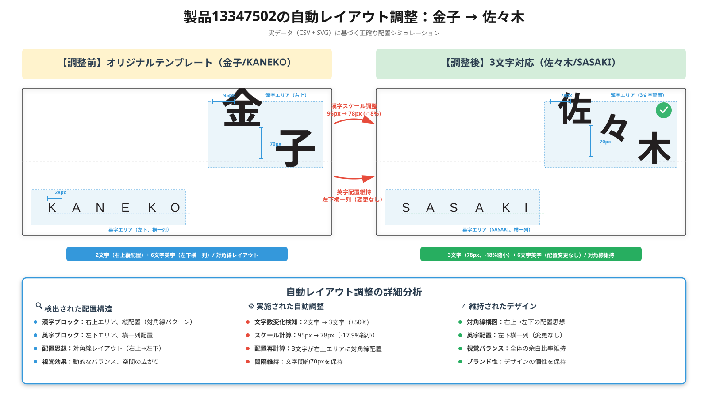

## **1. 本日のプレゼン全体像（アジェンダ）**

1-1. プロジェクト全体のロードマップ
1-2. 表札取付寸法測定デモ
1-3. 自動レイアウト**（カーニング）デモ**
1-4. オープニングアニメーションのデモ
1-5. 御見積のご説明
1-6. 本日の結論と今後の進め

---

## **2. プロジェクト全体のロードマップ**

---

## **3. 表札取付寸法測定デモ**

---

## **4. 自動レイアウト（カーニング）デモ**

図：金子→佐々木の表札自動レイアウト調整　SVGシミュレーション

  

---

## **5. オープニングアニメーションのデモ**

※1-4に対応

* 5-1. オープニングアニメーションの目的と効果
* 5-2. アニメーションの技術仕様
* 5-3. ユーザー体験への影響
* 5-4. デモ実演：オープニングアニメーションの動作確認

---

## **6. 御見積のご説明**

※1-5に対応

* 6-1. 開発範囲の明確化（3章・4章の内容）
* 6-2. 開発ステップとスケジュール
* 6-3. 表札取付寸法測定機能の本番適用プロセス
* 6-4. カーニングエンジンの本番適用プロセス
* 6-5. 商品レイアウトテンプレート対応プロセス
* 6-6. 継続改善とアップデート運用
* 6-7. 見積金額の内訳と説明

---

## **7. 本日の結論と今後の進め**

※1-6に対応

* 7-1. 今回実施する領域（3章・4章）の価値とデモ実演のまとめ
* 7-2. 将来構想（一体化レタリング自動生成）に向けた協議ポイント
  * 7-2-1. 一体物レタリングの市場ニーズ
  * 7-2-2. 現状の技術課題（接続点・太さ・強度ルールが未定義）
  * 7-2-3. 客先ノウハウ（造形ルール）の提供が必要な理由
  * 7-2-4. 造形ルールのデータ化アプローチ
  * 7-2-5. 機械学習による接続点推定の可能性
  * 7-2-6. 共同プロトタイプ開発の提案
* 7-3. 導入ステップとロードマップ
  * 7-3-1. 今回の実行範囲（3章・4章）の開発ステップ
  * 7-3-2. 将来的なレタリング生成への段階的検討
* 7-4. 直近のアクション案と次のステップ

---

